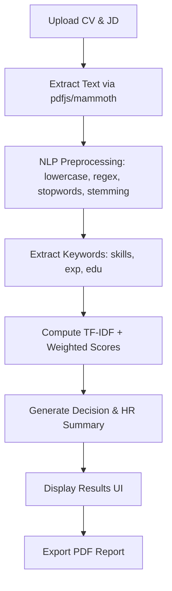

# HR CV-JD Match Assistant

A production-ready browser-only application for HR professionals to match Candidate Resumes (CV) with Job Descriptions (JD).

## Features
- **Client-Side Processing**: No data is sent to any server. Your privacy is guaranteed.
- **Multi-format Support**: Extract text from PDF, DOCX, and TXT files directly in the browser.
- **NLP Powered**: Uses TF-IDF vectorization and Cosine Similarity for semantic matching.
- **Skill Gap Analysis**: Automatically identifies missing skills required by the JD.
- **HR Summary**: Generates a 5-6 line recommendation for the candidate.
- **PDF Export**: Generate high-quality PDF reports for recruitment files.

## Tech Stack
- **React 18** with **TypeScript**
- **Bootstrap 5** for UI
- **pdfjs-dist**: PDF text extraction
- **mammoth.js**: DOCX text extraction
- **jsPDF + AutoTable**: PDF report generation
- **Custom NLP Logic**: Stopword removal, stemming, and TF-IDF implementation.

## Workflow Diagram

## Scoring Logic
The final match score is a weighted average:
- **50% TF-IDF Similarity**: Semantic overlap of the content.
- **30% Skills Coverage**: Percentage of required JD skills present in the CV.
- **10% Experience Alignment**: Matching of years of experience and role-based keywords.
- **10% Education Match**: Checking for degrees like BS, MS, PhD.

### Thresholds
- **>= 70%**: Strong Candidate (Green)
- **40 - 70%**: Moderate Fit (Yellow)
- **< 40%**: Not Fit (Red)

## Setup
1. `npm install`
2. `npm run dev`

Files are extracted using native `FileReader` and specialized WASM/JS libraries. All computations happen in the browser's main thread.
